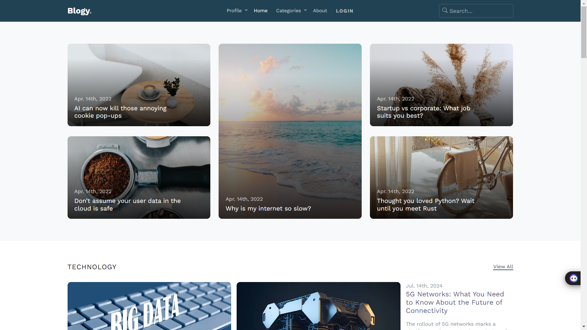
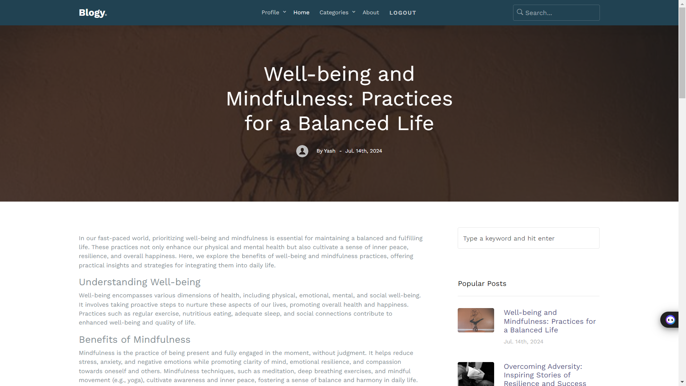
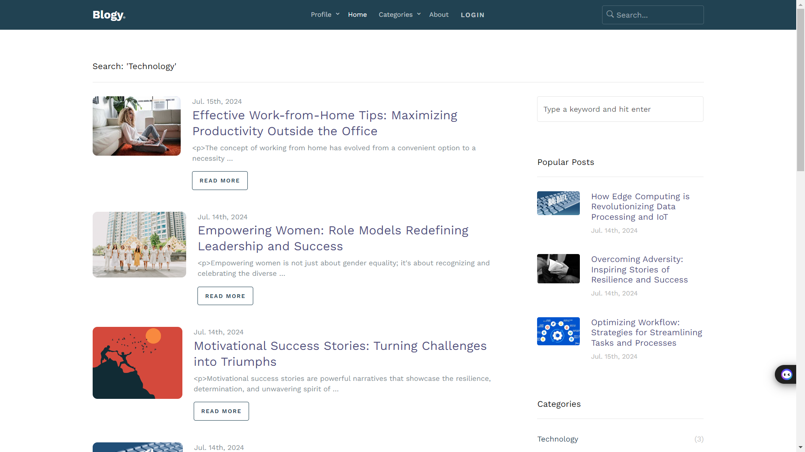
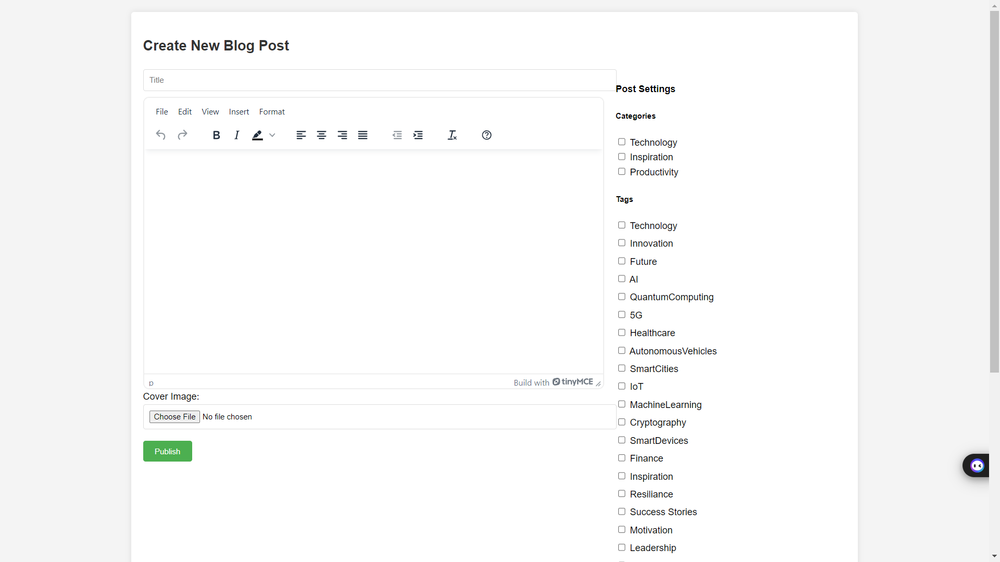

# Tech Tales

## Description

A personal blog application built using Django. It supports user authentication, category-based navigation, search functionality, and comments. The backend integration is handled by Django with PostgreSQL as the database, provided by Railways.com. Media files are stored using an Amazon S3 bucket. The application features a beautiful and user-friendly UI. The project is deployed and accessible online.

## Features

- User authentication (sign-in, sign-up, sign-out)
- Category-based navigation
- Search functionality for posts
- Rich text editor (TinyMCE) for creating and editing posts
- Comment functionality for posts
- Image upload previews
- Minor animations for enhanced user experience
- Optimized Django views for better performance
- Unit and integration tests to ensure functionality

## Deployment

This project is deployed using Vercel. You can check it out here: https://techtalez.vercel.app/

## Installation

### Prerequisites

- Python 3.x
- pip (Python package installer)
- Django

### Steps

1. Clone the repository:
   ```bash
   git clone <repository-url>
   ```
2. Navigate to the project directory:
   ```bash
   cd personal-blog
   ```
3. Create and activate a virtual environment:
   ```bash
   python -m venv env
   source env/bin/activate   # On Windows, use `env\Scripts\activate`
   ```
4. Install the required packages:
   ```bash
   pip install -r requirements.txt
   ```
5. Create a `.env` file in the project root and add the following:
   ```
   TINYMCE_API_KEY=your-tinymce-api-key
   DATABASE_NAME=your-database-name
   DATABASE_USER=your-database-username
   DATABASE_PASSWORD=your-database-password
   DATABASE_HOST=your-database-host
   DATABASE_PORT=your-database-port
   AWS_ACCESS_KEY_ID=your-aws-access-key-id
   AWS_SECRET_ACCESS_KEY=your-aws-secret-access-key
   AWS_STORAGE_BUCKET_NAME=your-aws-bucket-name
   ```
6. Apply the migrations:
   ```bash
   python manage.py migrate
   ```
7. Run the development server:
   ```bash
   python manage.py runserver
   ```

## Usage

1. Access the application in your web browser at `http://127.0.0.1:8000/` (or the deployed URL).
2. Register for an account or log in if you already have one.
3. Create, edit, and manage your blog posts.
4. Use the search functionality to find specific posts.
5. Browse posts by categories.
6. Leave comments on posts.

### App Preview:

<table width="100%">
  <tr>
    <td width="50%">
      <p align="center">Home Page</p>
      <p align="center">
        
      </p>
    </td>
    <td width="50%">
      <p align="center">Post Page</p>
      <p align="center">
        
      </p>
    </td>
  </tr>
   <tr>
    <td width="50%">
      <p align="center">Search Page</p>
      <p align="center">
        
      </p>
    </td>
    <td width="50%">
      <p align="center">Editor Page</p>
      <p align="center">
        
      </p>
    </td>
  </tr>
</table>


## Contributing

Contributions are welcome! Please follow these steps to contribute:

1. Fork the repository.
2. Create a new branch for your feature or bug fix:
   ```bash
   git checkout -b feature-name
   ```
3. Make your changes and commit them with descriptive messages.
4. Push your changes to your forked repository:
   ```bash
   git push origin feature-name
   ```
5. Create a pull request, describing the changes you made.

## License

This project is licensed under the MIT License.

## Contact Information

For inquiries or support, please contact me via LinkedIn or email.
